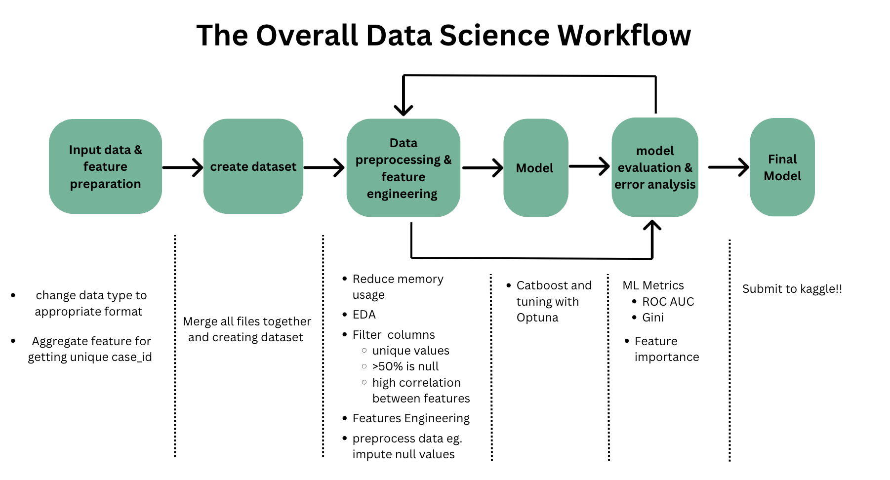

# Kiddee-Home Credit - Credit Risk Modeling

## Project overview

This repository is a part of the weekly hackathon in SuperAI Engineer (Season 4). For this week is Home Credit - Credit Risk Modeling

## Overview problem :

The goal of this competition is to predict which clients are more likely to default on their loans. The evaluation will favor solutions that are stable over time.

Your participation may offer consumer finance providers a more reliable and longer-lasting way to assess a potential client’s default risk.

This Competition uses data from the official Kaggle competition: Home Credit - Credit Risk Model Stability

https://www.kaggle.com/competitions/home-credit-credit-risk-model-stability/overview

Furthermore, we are confronted with the task of utilizing LLM to enhance the Data Science workflow.

## Problem -solving Approach :

Here is the overall data science workflow. Our team is trying to apply LLM to this workflow by:

1. Assisting with EDA (Visualization, Explanation) by creating an automated process for LLM to plot and generate data explanations.
2. Helping clean data, which normally requires time to consider the type and value of each column, by allowing LLM to handle the evaluation instead.
3. Enabling LLM to analyze column names and automatically merge or drop columns.

### Implementing Few-Shot Learning in LLM Models

Our team has also applied few-shot learning to the LLM model to enhance its performance and capabilities. This approach includes providing prompt code and examples, such as:

- Assigning roles to the model
- Clarifying its current status
- Defining the desired state to achieve enhanced understanding

By clearly expressing our expectations from the model's responses, we ensure comprehensive communication and achieve the desired outcomes. This method allows the model to better understand the context and deliver more accurate and relevant results.

